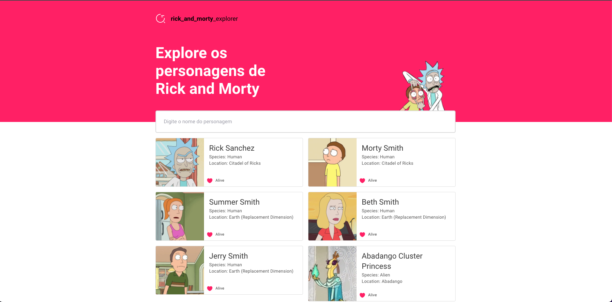

# Rick and Morty Explorer

<p align="center">
   
</p>

<div style="text-align: center">

  [](https://github.com/lucaxsilveira)
  [](#)
  [](https://github.com/lucaxsilveira/rick-and-morty-explorer/stargazers)
  [](https://github.com/lucaxsilveira/rick-and-morty-explorer/network/members)

</div>


This is a React JS application that uses the [https://rickandmortyapi.com](https://rickandmortyapi.com) public api.

## Made with:
- React JS
- Typescript
- Styled Components
- Material UI
- Craco

# Installation

**Install dependencies**

```yarn install```

---

**Development server**

```yarn start```

Runs the app in the development mode.
Open http://localhost:3000 to view it in the browser.

The page will reload if you make edits.
You will also see any lint errors in the console.

---

**Production build**

```yarn build```

Builds the app for production to the build folder.
It correctly bundles React in production mode and optimizes the build for the best performance.

The build is minified and the filenames include the hashes.
Your app is ready to be deployed!


# License

Released in 2022.
This project is under the [MIT license](https://github.com/lucaxsilveira/rick-and-morty-explorer/blob/master/LICENSE).

Made with coffe by [Lucas Silveira](https://github.com/lucaxsilveira)